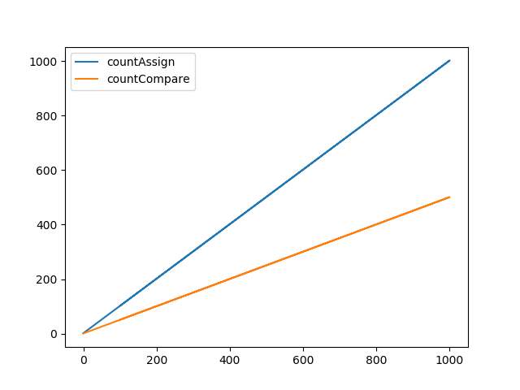
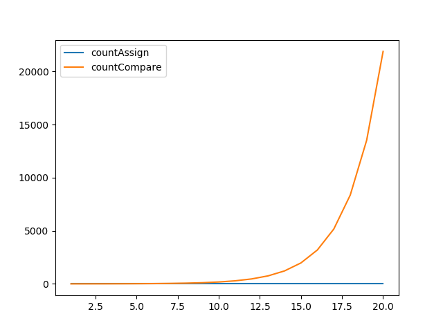
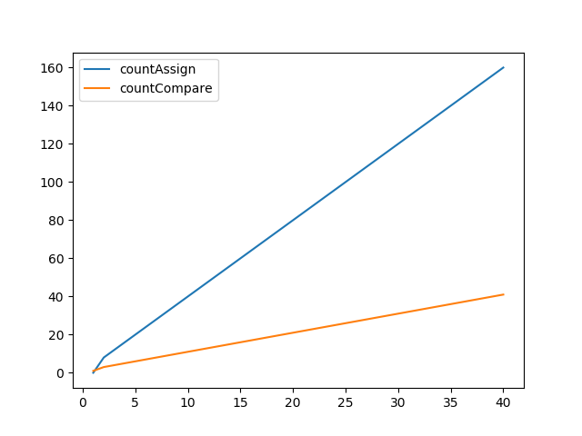

# Running for Ubuntu

This is example 1 of Algorithm and Complexity Course in VNU - HCMUS

## Command for sumOdd

To running sumOdd.cpp and visualization.py you just do it

```bash
cd AlgorithmsAndComplexity/Ex01/src
bash sumOdd.sh
```

## Visualization for sumOdd

Compare your result with this image.



## Command for fibonacciRecursive

To running fibonacciRecursive.cpp and visualization.py you just do it

```bash
cd AlgorithmsAndComplexity/Ex01/src
bash fibonacciRecursive.sh
```

## Visualization for fibonacciRecursive 

Compare your result with this image.



## Command for fibonacci

To running fibonacci.cpp and visualization.py you just do it

```bash
cd AlgorithmsAndComplexity/Ex01/src
bash fibonacci.sh
```

## Visualization for fibonacci

Compare your result with this image.




