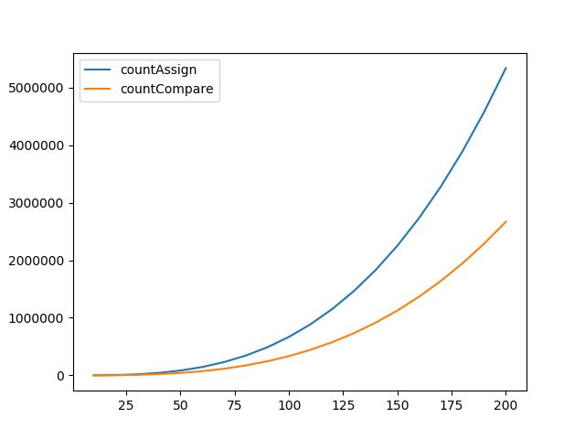

# Running for Ubuntu

This is example 2 of Algorithm and Complexity Course in VNU - HCMUS

## Command for someSum

To running someSum.cpp and visualization.py you just do it

```bash
cd AlgorithmsAndComplexity/Ex02/src
bash someSum.sh
```

## Visualization for someSum

Compare your result with this image.



## Inference 

We are easy to predict complexity of someSum is  n<sup>3</sup> ( O(n<sup>3</sup>)). In first loop, we i variable is from 1 to n. Morever, j variable is from (n - i)  to 
i<sup>2</sup> . Therefore, someSum's number of operation is equal or less than n<sup>3</sup> operations.

``` C++
int SomeSum(int n, int& countAssign, int& countCompare){
    int sum = 0, i = 1;
    countAssign += 2;
    int j;

    while (++countCompare && i <= n){
        j = n - i;
        countAssign++;
        while (++countCompare && j < i*i){
            sum = sum + i*j;
            countAssign++;
            j = j+1;
            countAssign++;
        }
        i = i + 1;
        countAssign++;
    }

    return sum;
}
```

## Prove by limit 

**Common orders of growth.**

|Code   | Notation | Code|
|-----  | -------- | :--- |
|Linear | | for (int i = 0; i < n; ++i) { </br> &nbsp; &nbsp; &nbsp; op();</br>&nbsp; &nbsp; &nbsp; for (int j = n-i; j < i*i; ++j) </br> &nbsp; &nbsp; &nbsp; &nbsp; &nbsp; &nbsp; op(); </br> }|

**Function of number of opertions**


**Function of number of assign**


</br>


**Function of number of compare**


</br>


**Comapre with **


</br>


</br>


</br>

Therefore, Big-O of someSum is  
